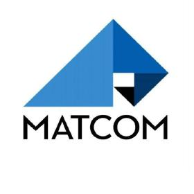

<h1 align="center"> Programación MATCOM (UH)</h1>
<h2 align="center">Curso 2025 - 2026</h2>

  
  

    <a href="#-acerca-del-repositorio" target="_blank">
        Acerca Del Repositorio
    </a>
    &nbsp;✦&nbsp;
    <a href="#-contenido" target="_blank">
        Contenido
    </a>
    &nbsp;✦&nbsp;
    <a href="#-tecnologías" target="_blank">
        Tecnologías
    </a>
    &nbsp;✦&nbsp;
    <a href="#-comandos" target="_blank">
        Comandos
    </a>
    &nbsp;✦&nbsp;
    <a href="#-contribuciones" target="_blank">
        Contribuciones
    </a>
    &nbsp;✦&nbsp;
    <a href="#-licencia" target="_blank">
        Licencia
    </a>
    &nbsp;✦&nbsp;
    <a href="#-Soporte" target="_blank">
        Soporte
    </a>

 

> [!TIP]
> Si quieres leer este readme en **inglés**:
> - [**README en Inglés**](https://github.com/joserafael0160/programacion-matcom-25-26/blob/main/README.en.md)

## 📜 Acerca Del Repositorio 
Hola, soy **José Rafael** (C-122) 👋.

Este repositorio contiene los **ejercicios y mis soluciones** de las clases prácticas que recibo en la Facultad de Matemática y Computación ([MATCOM](https://github.com/matcom)) de la Universidad de La Habana (UH) curso 2025 - 2026. 

Como estudiante de primer año, mi objetivo es compartir recursos educativos valiosos que puedan ayudar a otros estudiantes a comprender mejor los conceptos y técnicas enseñados en nuestras clases 🎓.

## 📚 Contenido
- [**Ejercicios y Soluciones**](#-clases-prácticas): Una colección de ejercicios prácticos junto con sus soluciones detalladas. Estos ejercicios cubren una variedad de temas que se enseñan en el primer año de la carrera de Ciencias de la Computación.
- **Proyectos**: Proyectos más grandes y complejos que se desarrollan a lo largo del curso. Estos proyectos están diseñados para aplicar los conocimientos adquiridos en situaciones más realistas y desafiantes.
- **Recursos Adicionales**: Material complementario como artículos, tutoriales y enlaces a recursos en línea que pueden ser útiles para profundizar en los temas tratados en clase.

(<a href="#top">Volver al inicio 🔝</a>)

## 🧰 Tecnologías
- [**Python**](https://www.python.org/) - Un lenguaje de programación interpretado, multiparadigma y de alto nivel, ampliamente utilizado en ciencia de datos, desarrollo web, automatización, inteligencia artificial y enseñanza de algoritmos. Su sintaxis clara y su enorme ecosistema lo hacen ideal para aprender y construir soluciones robustas.
- [**VSCode**](https://code.visualstudio.com/) - Un editor de código potente y ligero desarrollado por Microsoft, que ofrece un conjunto rico de características para codificación, depuración y control de versiones, lo que lo hace ideal para el desarrollo moderno de software y aplicaciones web.

(<a href="#top">Volver al inicio 🔝</a>)

## 🧞 Comandos
|      | Comando   | Acción                                         |
| :--- | :-------- | :-------------------------------------------- |
| ⚙️    | `python3.12 "nombre_del_archivo.py"`     | Ejecuta el script del archivo.           |

(<a href="#top">Volver al inicio 🔝</a>)

## 🤝 Contribuciones

¡Las contribuciones son siempre bienvenidas! Ya sea que estés informando errores o mejorando las funcionalidades existentes, tu ayuda es **muy apreciada**.

Si tienes alguna sugerencia que podría mejorar alguna solución, por favor haz un [_fork_](https://github.com/joserafael0160/programacion-matcom-25-26/fork) del repositorio y crea una [_pull request_](https://github.com/joserafael0160/programacion-matcom-25-26/pulls). También puedes simplemente abrir un [_issue_](https://github.com/joserafael0160/programacion-matcom-25-26/issues) con la etiqueta "enhancement".

Aquí tienes una guía rápida:

1. Haz un [_fork_](https://github.com/joserafael0160/programacion-matcom-25-26/fork) del Proyecto
2. Clona tu [_fork_](https://github.com/joserafael0160/programacion-matcom-25-26/fork) (`git clone <URL del fork>`)
3. Añade el repositorio original como remoto (`git remote add upstream <URL del repositorio original>`)
4. Crea tu Rama de Funcionalidad (`git switch -c feature/CaracteristicaNueva`)
5. Realiza tus Cambios (`git commit -m 'Add: alguna CaracterísticaNueva'`)
6. Haz Push a la Rama (`git push origin feature/CaracteristicaNueva`)
7. Abre una [_pull request_](https://github.com/joserafael0160/programacion-matcom-25-26/pulls)

(<a href="#top">Volver al inicio 🔝</a>)

## 🔑 Licencia
[MIT](https://github.com/joserafael0160/programacion-matcom-25-26/blob/main/LICENSE)

(<a href="#top">Volver al inicio 🔝</a>)

## 🙏 Soporte
No olvides dejar una estrella ⭐️

(<a href="#top">Volver al inicio 🔝</a>)

 

✌️

Un proyecto creado por <a href="https://github.com/joserafael0160">@joserafael0160</a>
